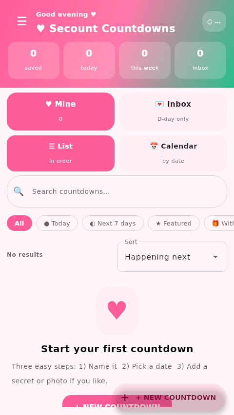

# Secount ♥ Countdown Studio

**Se**cret + **Count** — a personal cross-platform countdown and private-moment application designed to keep important moments organized, synchronized, and private until the right time.

Secount is built with **Kotlin + Compose Multiplatform** for Windows and Android. Shared product logic and UI keep the two platforms aligned while platform adapters handle native capabilities.

> Birthdays • Exams • Weddings • Holidays • Trips • Work deadlines • App launches • Game launches • Private surprises

## ✨ Runtime preview

This image is captured from the **running Secount desktop application**, not a mockup.



GitHub Actions refreshes the runtime preview when the application source changes.

## 💗 Product vision

Secount is a personal product project focused on a simple idea: a countdown can be more meaningful when the moment, message, and people involved stay together in one experience.

### Core experience

- **Modern Material 3 UI** with rounded surfaces and clear hierarchy.
- **Valentine-first visual language** with a warm rose/pink identity while keeping the product usable beyond one occasion.
- **Live countdowns** with days, hours, minutes and seconds.
- **Mine / Inbox** views for personal countdowns and partner surprises.
- **Letter-style secret reveal** with an explicit OPEN MESSAGE step.
- **Replies and conversation threads** with You / Partner labels.
- **Delivered / Seen receipts** with timestamps.
- **Search, filters and sorting** for larger collections.
- **List and Calendar views**.
- **Categories, icons and accent colors** per countdown.
- **Photo attachments** with synced thumbnails.
- **Six-letter pairing codes + QR / copy-paste pairing**.
- **Offline retry and synchronization** for supported edits, replies, deletes and receipts.
- **App PIN + biometric unlock** where supported.
- **Backup and restore**, including optional encrypted backups.
- **Android widget support**.
- **Windows + Android** from one shared Kotlin/Compose codebase.

## 🔐 Private secret-message flow

1. Create a countdown.
2. Enable **Secret message at zero**.
3. Write the private message.
4. Continue using Secount normally while the message remains sealed.
5. At zero, the recipient receives the secret-message prompt.
6. **OPEN MESSAGE** starts the letter-style reveal.
7. The recipient can reply inside the same conversation.

## 🤝 Partner pairing & sync

Two Secount installations can connect using a six-letter pairing code.

- Share a code or QR payload.
- Enter the partner code.
- Confirm the connection on both sides.
- Sync supported countdown edits, deletes, replies, and receipts.
- Keep partner surprises hidden until their target time.
- Disconnect requires agreement from both sides.

## 🎨 UI & themes

The default **Valentine** theme is designed to feel romantic without becoming a novelty card:

- Soft warm background
- High-contrast typography
- Rounded Material surfaces
- Accent-colored countdown identity
- Compact status pills
- Clear primary actions
- Dark-mode support
- Additional themes including Midnight Android, Ocean, Sunset, Forest, Lavender and Porcelain

## 📱 Platforms

### Windows

The desktop target is packaged as a native Windows executable and a JVM JAR.

### Android

Android targets API 26+ and supports the shared Compose application plus the Secount widget.

Production APKs are distributed through GitHub Releases; debug builds are intended for development/testing.

## 🛠️ Tech stack

- **Kotlin 2.1.x**
- **Compose Multiplatform / Material 3**
- **Gradle 8.13**
- **Android API 26–36**
- **Desktop JVM / Windows packaging**
- **ZXing** for QR generation
- **Kotlin coroutines** for asynchronous work
- **GitHub Actions** for testing, builds, runtime media and releases
- **CodeQL + Dependabot** for automated security/dependency maintenance

## 🧱 Project structure

```text
android/
├── shared/       # Shared product logic, storage, sync, security and Compose UI
├── androidApp/   # Android entry point, resources and widget integration
└── desktopApp/   # Desktop entry point and Windows packaging

docs/
├── ARCHITECTURE.md
└── RELEASE.md

assets/
└── runtime-screenshot.png
```

See [`docs/ARCHITECTURE.md`](./docs/ARCHITECTURE.md) for architectural boundaries and refactoring guidance.

## ▶ Build locally

### Windows desktop

```bat
build.bat
```

### Android release APK

```bat
cd android
gradle :androidApp:assembleRelease
```

### Shared tests

```bat
gradle -p android :shared:desktopTest
```

## ⚙️ Engineering & CI

The repository separates validation, runtime-media capture and releases.

- Shared tests run automatically.
- Desktop and Android release artifacts are built in CI.
- Build artifacts are validated for basic integrity before publication.
- Release artifacts receive SHA-256 checksums.
- GitHub Releases are created from version tags.
- CodeQL analyzes the Kotlin codebase.
- Dependabot monitors Gradle and GitHub Actions dependencies.
- Runtime media is generated from the actual desktop application.

Generated release binaries are intentionally treated as release artifacts rather than source files.

## 🔐 Security

Security-sensitive areas include local storage, PIN protection, pairing/synchronization, backups, permissions, and CI/release integrity.

See [`SECURITY.md`](./SECURITY.md) for the reporting policy and [`docs/ARCHITECTURE.md`](./docs/ARCHITECTURE.md) for engineering boundaries.

## 🗺️ Roadmap

- [x] Cross-platform Windows + Android foundation
- [x] Shared Compose UI and event model
- [x] Secret-message countdown flow
- [x] Partner pairing and sync foundation
- [x] Android widget
- [x] Backup/restore foundation
- [x] Runtime screenshot automation
- [x] Automated tests and release artifact validation
- [x] Security/dependency automation
- [x] Deeper security threat model and security regression coverage
- [x] Expanded automated countdown/security test coverage and QA matrix
- [ ] Further UI/component decomposition of the large App.kt
- [ ] Richer platform-specific notifications and reminders
- [x] Release metadata validation and generated-artifact guardrails

## 📚 Project documents

- [`CHANGELOG.md`](./CHANGELOG.md) — product and engineering changes
- [`SECURITY.md`](./SECURITY.md) — security reporting policy
- [`CONTRIBUTING.md`](./CONTRIBUTING.md) — development expectations
- [`docs/ARCHITECTURE.md`](./docs/ARCHITECTURE.md) — architecture and refactoring boundaries
- [`docs/RELEASE.md`](./docs/RELEASE.md) — release process and artifact policy
- [`docs/THREAT-MODEL.md`](./docs/THREAT-MODEL.md) — security boundaries and invariants
- [`docs/SYNC.md`](./docs/SYNC.md) — pairing, sync and failure model
- [`docs/TEST-MATRIX.md`](./docs/TEST-MATRIX.md) — automated and manual QA coverage
- [`docs/PRODUCTION-READINESS.md`](./docs/PRODUCTION-READINESS.md) — production release gate

## 👨‍💻 Creator

### Md. Ragib Ashhab

Secount is a **personal software product project** — built, maintained, and evolved independently as part of a broader portfolio of software, AI, graphics, and engineering work.

- 🌐 Portfolio: [ragibashhab.netlify.app](https://ragibashhab.netlify.app/)
- 🔗 Linktree: [linktr.ee/RagibAshhab](https://linktr.ee/RagibAshhab)
- 💼 LinkedIn: [md-ragib-ashhab-768a19240](https://www.linkedin.com/in/md-ragib-ashhab-768a19240/)
- 🐙 GitHub: [TheKIAR](https://github.com/TheKIAR)

---

*Secount — keep the moment. Protect the surprise. Let zero tell the story.*
